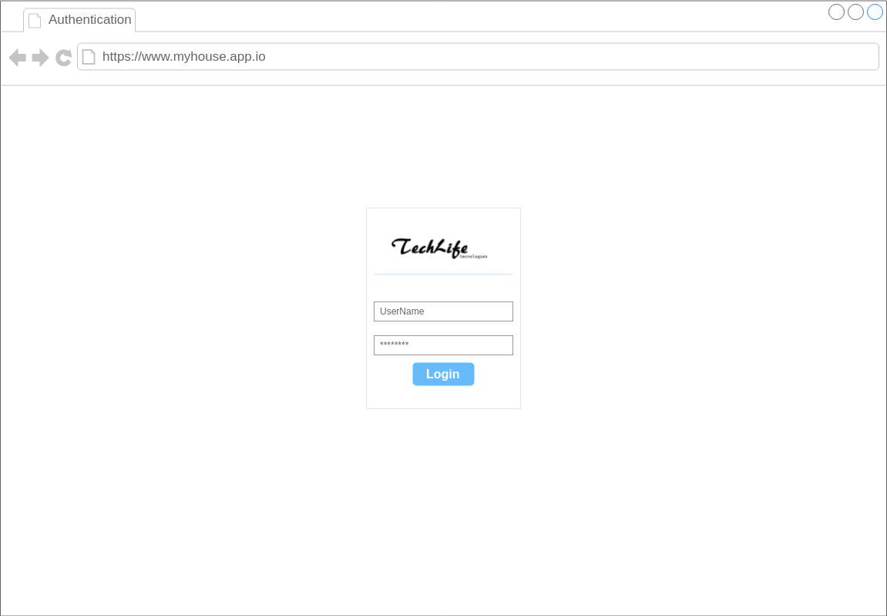
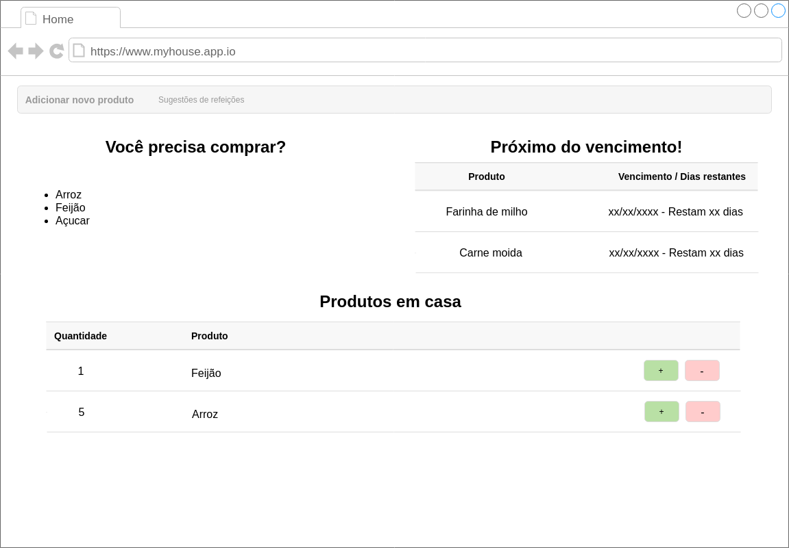
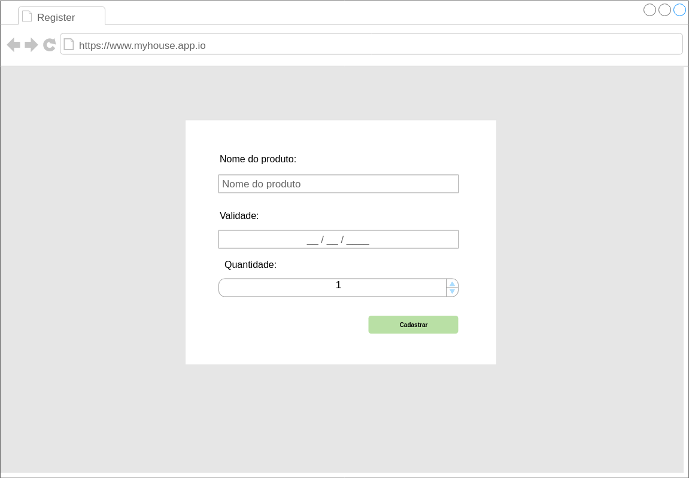
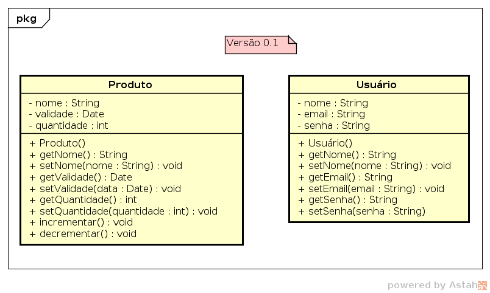
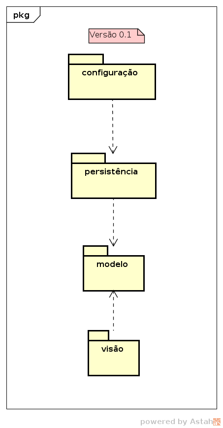
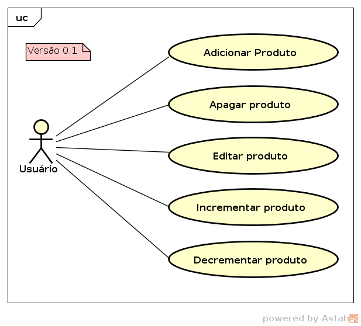

# Documentação do projeto TenhoEmCasa

Este repositório serve de base para as implementações deste projeto nas respectivas tecnologias citadas abaixo:

**JSF**: [https://gitlab.com/papejajr_java/jsf/tenho-em-casa](https://gitlab.com/papejajr_java/jsf/tenho-em-casa)

## Documento base

A seguir será demonstrado os artefatos produzidos.

### Protótipos de telas

Tela de Login

Página inicial

Página de cadastro de produto

### Diagrama de classe

### Diagrama de Pacote

### Diagrama de caso de usos

## Referências

Astah Community [http://astah.net/editions/community](http://astah.net/editions/community)

Draw.io [https://www.draw.io/](https://www.draw.io/)